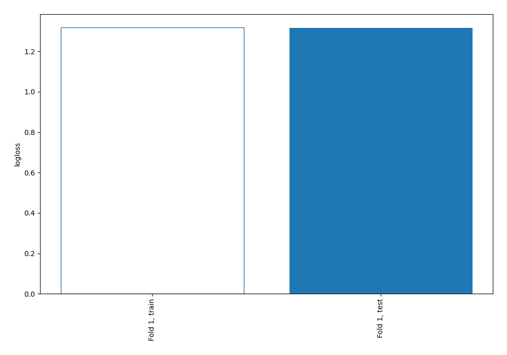
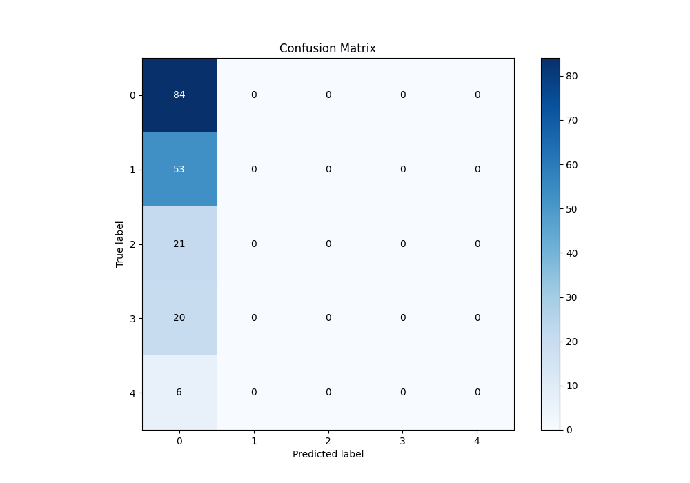
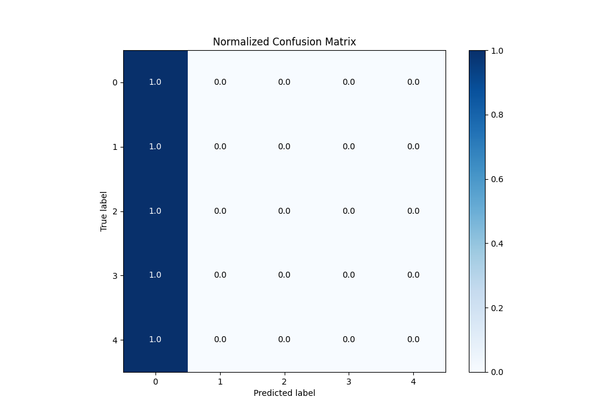
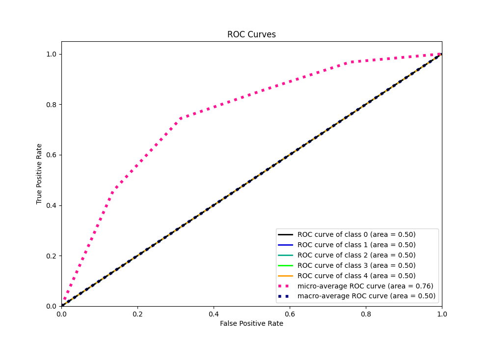
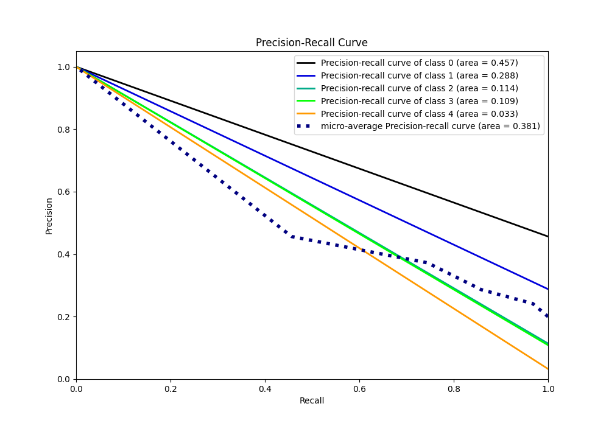

# Summary of 1_Baseline

[<< Go back](../README.md)

## Baseline Classifier (Baseline)
- **n_jobs**: -1
- **num_class**: 5
- **explain_level**: 1

## Validation
 - **validation_type**: split
 - **train_ratio**: 0.75
 - **shuffle**: True
 - **stratify**: True

## Optimized metric
logloss

## Training time

0.1 seconds

### Metric details
|           |         0 |   1 |   2 |   3 |   4 |   accuracy |   macro avg |   weighted avg |   logloss |
|:----------|----------:|----:|----:|----:|----:|-----------:|------------:|---------------:|----------:|
| precision |  0.456522 |   0 |   0 |   0 |   0 |   0.456522 |   0.0913043 |       0.208412 |   1.31705 |
| recall    |  1        |   0 |   0 |   0 |   0 |   0.456522 |   0.2       |       0.456522 |   1.31705 |
| f1-score  |  0.626866 |   0 |   0 |   0 |   0 |   0.456522 |   0.125373  |       0.286178 |   1.31705 |
| support   | 84        |  53 |  21 |  20 |   6 |   0.456522 | 184         |     184        |   1.31705 |

## Confusion matrix
|              |   Predicted as 0 |   Predicted as 1 |   Predicted as 2 |   Predicted as 3 |   Predicted as 4 |
|:-------------|-----------------:|-----------------:|-----------------:|-----------------:|-----------------:|
| Labeled as 0 |               84 |                0 |                0 |                0 |                0 |
| Labeled as 1 |               53 |                0 |                0 |                0 |                0 |
| Labeled as 2 |               21 |                0 |                0 |                0 |                0 |
| Labeled as 3 |               20 |                0 |                0 |                0 |                0 |
| Labeled as 4 |                6 |                0 |                0 |                0 |                0 |

## Learning curves

## Confusion Matrix

## Normalized Confusion Matrix

## ROC Curve

## Precision Recall Curve

[<< Go back](../README.md)
