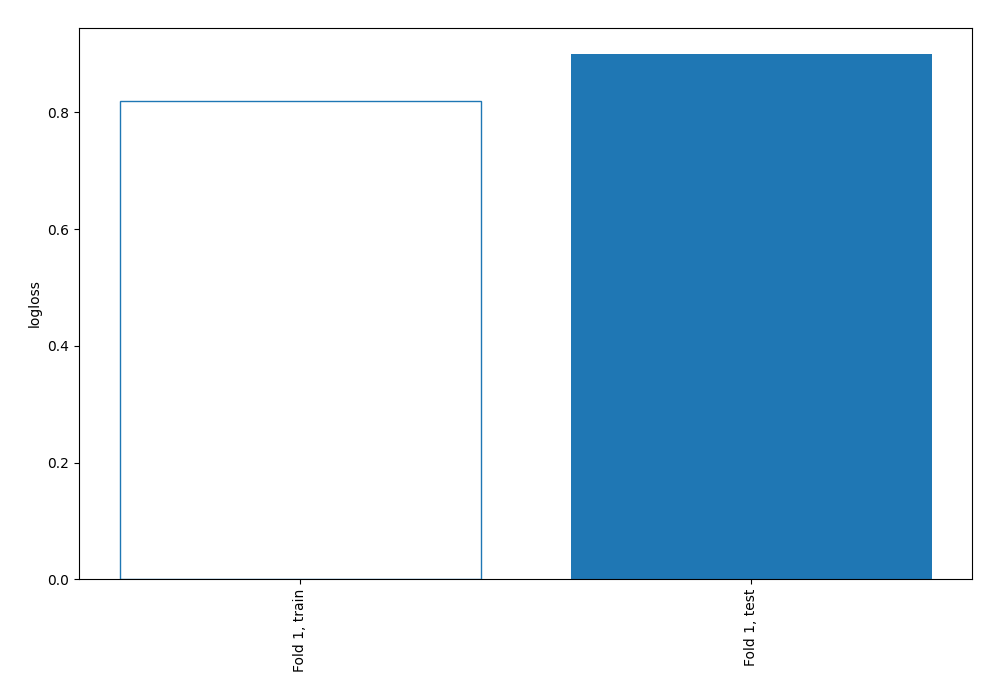
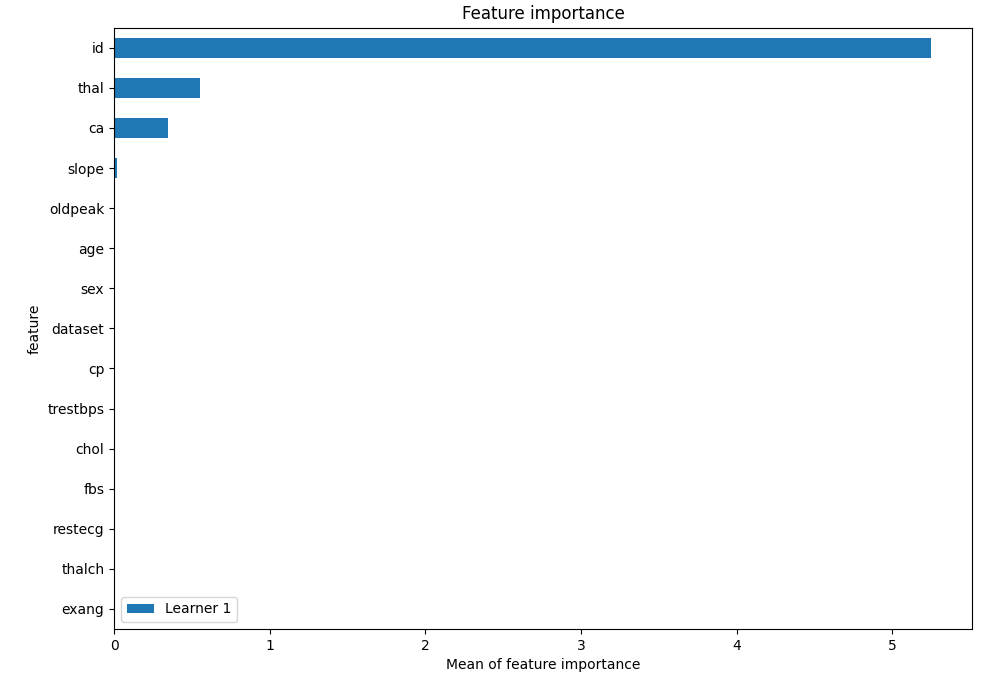
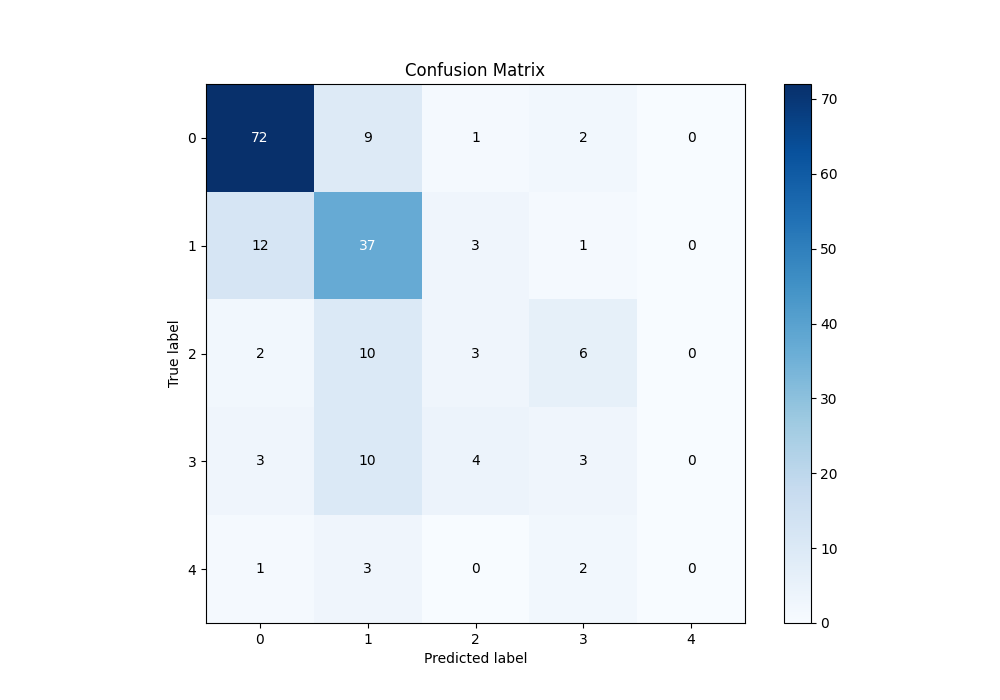
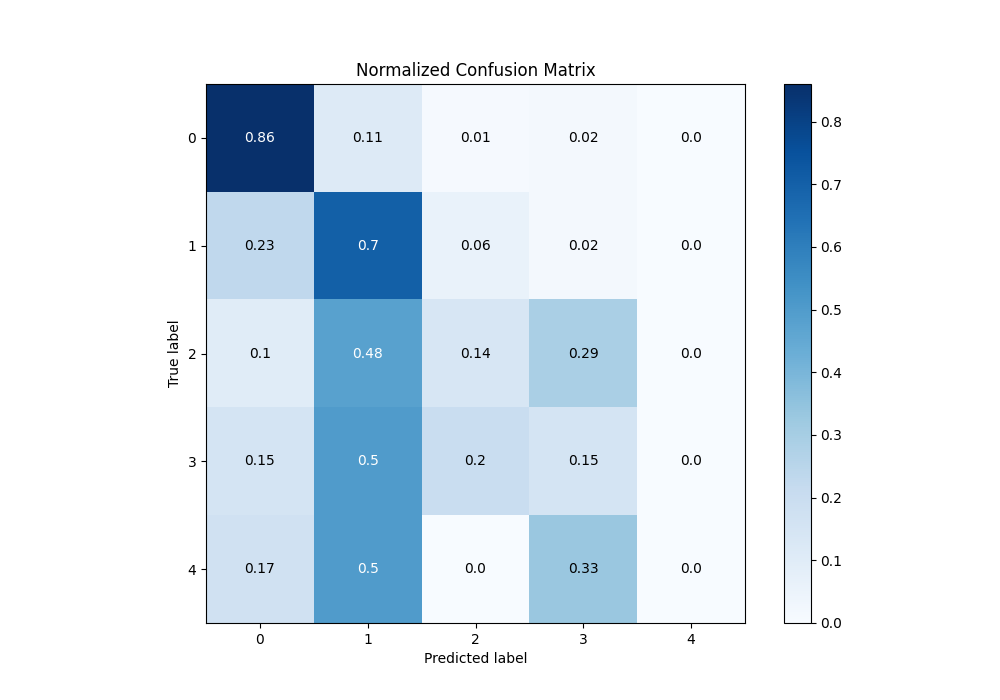
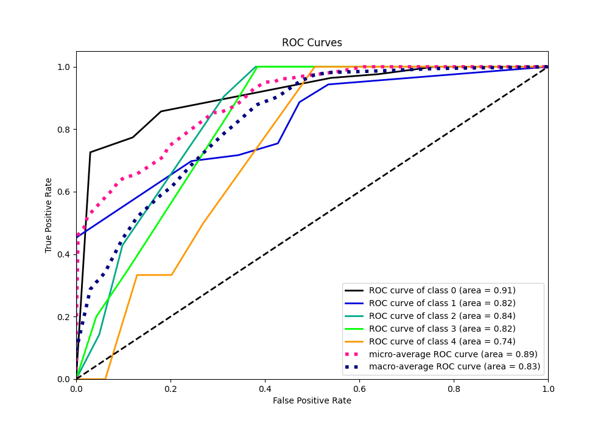
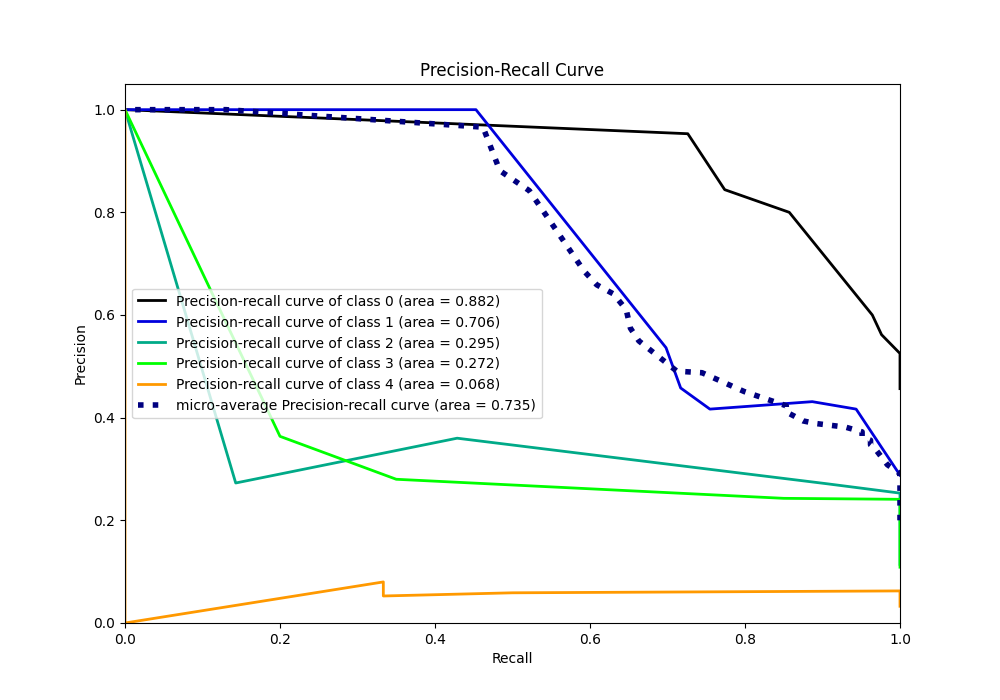

# Summary of 2_DecisionTree

[<< Go back](../README.md)

## Decision Tree
- **n_jobs**: -1
- **criterion**: gini
- **max_depth**: 3
- **num_class**: 5
- **explain_level**: 1

## Validation
 - **validation_type**: split
 - **train_ratio**: 0.75
 - **shuffle**: True
 - **stratify**: True

## Optimized metric
logloss

## Training time

2.7 seconds

### Metric details
|           |         0 |         1 |         2 |         3 |   4 |   accuracy |   macro avg |   weighted avg |   logloss |
|:----------|----------:|----------:|----------:|----------:|----:|-----------:|------------:|---------------:|----------:|
| precision |  0.8      |  0.536232 |  0.272727 |  0.214286 |   0 |      0.625 |    0.364649 |       0.574094 |  0.899835 |
| recall    |  0.857143 |  0.698113 |  0.142857 |  0.15     |   0 |      0.625 |    0.369623 |       0.625    |  0.899835 |
| f1-score  |  0.827586 |  0.606557 |  0.1875   |  0.176471 |   0 |      0.625 |    0.359623 |       0.593107 |  0.899835 |
| support   | 84        | 53        | 21        | 20        |   6 |      0.625 |  184        |     184        |  0.899835 |

## Confusion matrix
|              |   Predicted as 0 |   Predicted as 1 |   Predicted as 2 |   Predicted as 3 |   Predicted as 4 |
|:-------------|-----------------:|-----------------:|-----------------:|-----------------:|-----------------:|
| Labeled as 0 |               72 |                9 |                1 |                2 |                0 |
| Labeled as 1 |               12 |               37 |                3 |                1 |                0 |
| Labeled as 2 |                2 |               10 |                3 |                6 |                0 |
| Labeled as 3 |                3 |               10 |                4 |                3 |                0 |
| Labeled as 4 |                1 |                3 |                0 |                2 |                0 |

## Learning curves

## Permutation-based Importance

## Confusion Matrix

## Normalized Confusion Matrix

## ROC Curve

## Precision Recall Curve

[<< Go back](../README.md)
