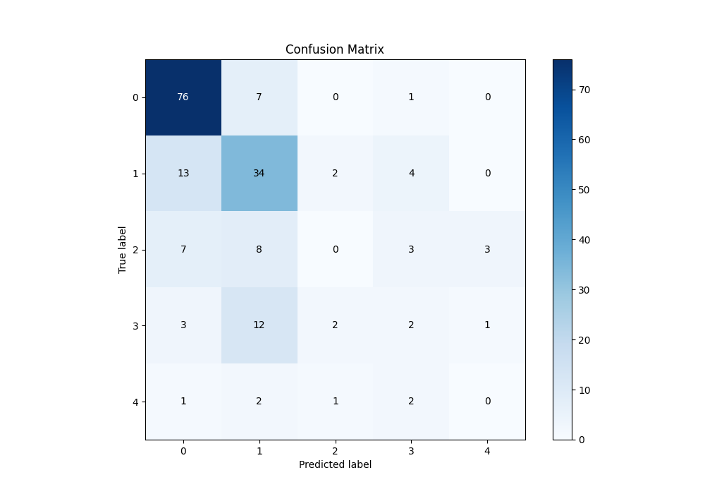

# Summary of 3_Linear

[<< Go back](../README.md)

## Logistic Regression (Linear)
- **n_jobs**: -1
- **num_class**: 5
- **explain_level**: 1

## Validation
 - **validation_type**: split
 - **train_ratio**: 0.75
 - **shuffle**: True
 - **stratify**: True

## Optimized metric
logloss

## Training time

0.2 seconds

### Metric details
|           |         0 |         1 |   2 |         3 |   4 |   accuracy |   macro avg |   weighted avg |   logloss |
|:----------|----------:|----------:|----:|----------:|----:|-----------:|------------:|---------------:|----------:|
| precision |  0.76     |  0.539683 |   0 |  0.166667 |   0 |   0.608696 |    0.29327  |       0.520524 |  0.986618 |
| recall    |  0.904762 |  0.641509 |   0 |  0.1      |   0 |   0.608696 |    0.329254 |       0.608696 |  0.986618 |
| f1-score  |  0.826087 |  0.586207 |   0 |  0.125    |   0 |   0.608696 |    0.307459 |       0.559567 |  0.986618 |
| support   | 84        | 53        |  21 | 20        |   6 |   0.608696 |  184        |     184        |  0.986618 |

## Confusion matrix
|              |   Predicted as 0 |   Predicted as 1 |   Predicted as 2 |   Predicted as 3 |   Predicted as 4 |
|:-------------|-----------------:|-----------------:|-----------------:|-----------------:|-----------------:|
| Labeled as 0 |               76 |                7 |                0 |                1 |                0 |
| Labeled as 1 |               13 |               34 |                2 |                4 |                0 |
| Labeled as 2 |                7 |                8 |                0 |                3 |                3 |
| Labeled as 3 |                3 |               12 |                2 |                2 |                1 |
| Labeled as 4 |                1 |                2 |                1 |                2 |                0 |

## Learning curves

## Coefficients

### Coefficients learner #1
|           |           0 |          1 |          2 |           3 |           4 |
|:----------|------------:|-----------:|-----------:|------------:|------------:|
| intercept |  1.52314    |  1.19675   |  0.0171161 | -0.294824   | -2.44218    |
| id        | -1.02368    |  1.91676   | -0.41385   | -0.511086   |  0.0318608  |
| age       | -0.00481796 | -0.252972  |  0.0535862 |  0.134293   |  0.0699111  |
| sex       | -0.665734   | -0.0972241 | -0.050426  | -0.260584   |  1.07397    |
| dataset   |  0.406033   | -1.80194   |  0.472072  |  0.643536   |  0.280303   |
| cp        |  0.555207   | -0.0663915 | -0.317875  |  0.164998   | -0.335939   |
| trestbps  | -0.0230494  | -0.0594745 | -0.0926621 |  0.00646918 |  0.168717   |
| chol      |  0.373171   |  0.0127982 | -0.230038  | -0.0266806  | -0.129251   |
| fbs       | -0.201695   | -0.031662  |  0.0986679 |  0.131712   |  0.00297689 |
| restecg   |  0.146487   | -0.0704248 |  0.0600507 |  0.275594   | -0.411707   |
| thalch    |  0.346403   |  0.151796  | -0.0108572 | -0.476122   | -0.0112196  |
| exang     | -0.289677   |  0.0637126 |  0.0736152 |  0.239165   | -0.0868159  |
| oldpeak   | -0.746362   | -0.18305   | -0.0553125 |  0.273981   |  0.710744   |
| slope     |  0.100054   | -0.124364  | -0.0961472 |  0.171188   | -0.0507301  |
| ca        | -0.732297   | -0.177631  |  0.2169    |  0.340163   |  0.352865   |
| thal      | -0.205813   |  0.110065  | -0.0468109 |  0.0831739  |  0.0593852  |

## Permutation-based Importance

## Confusion Matrix

## Normalized Confusion Matrix

## ROC Curve

## Precision Recall Curve

[<< Go back](../README.md)
