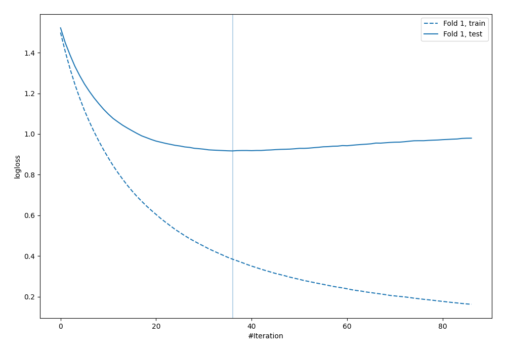
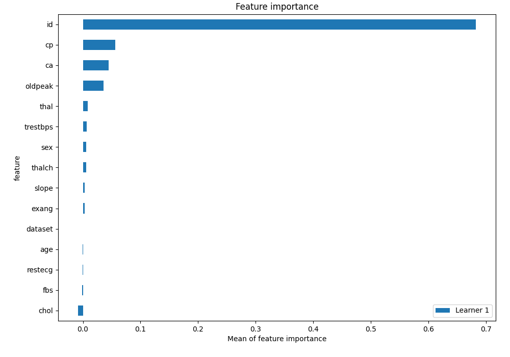
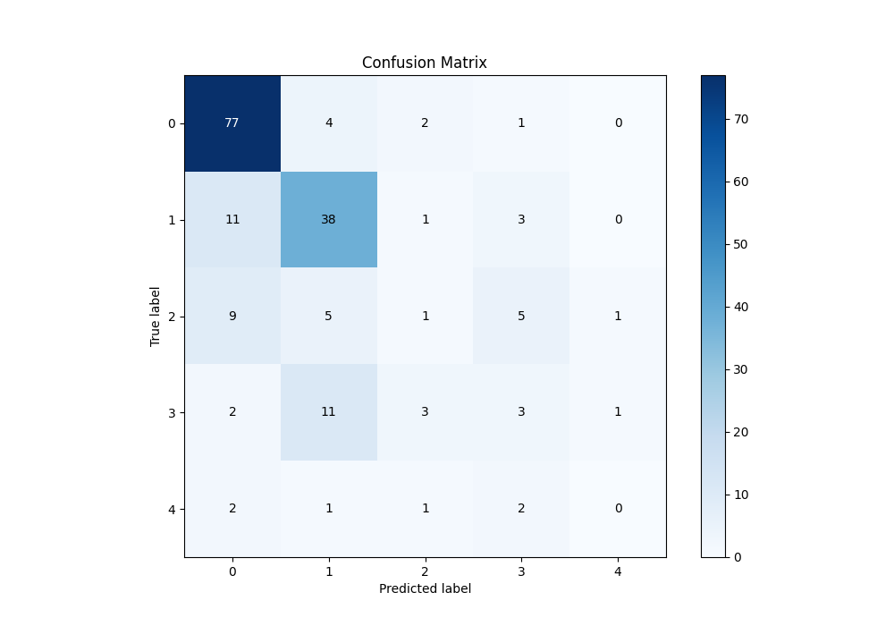
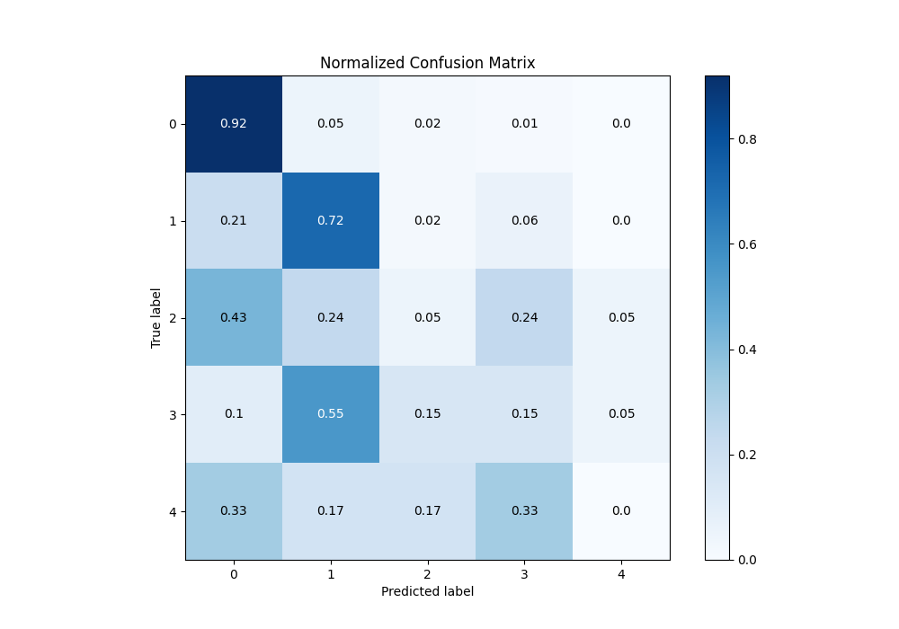
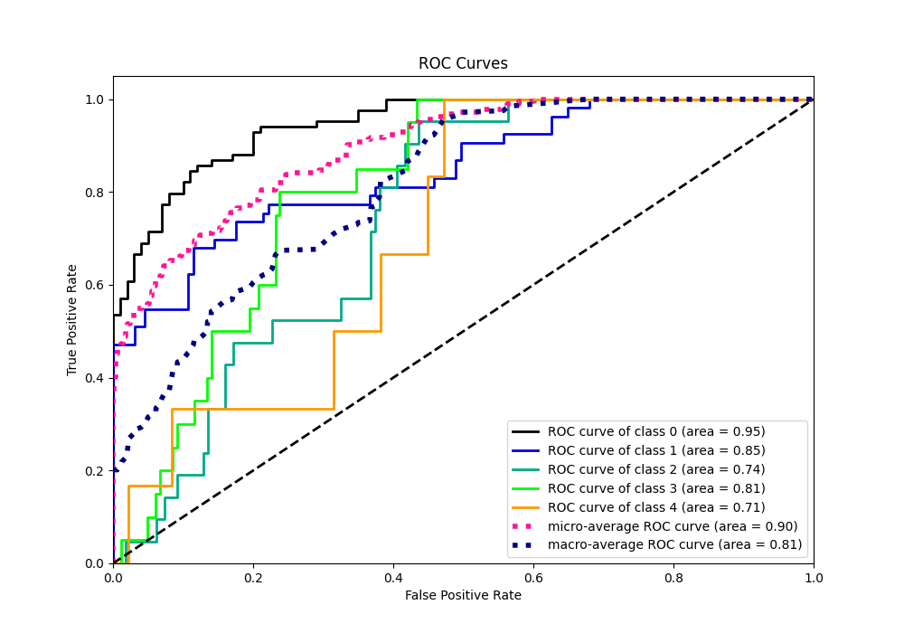
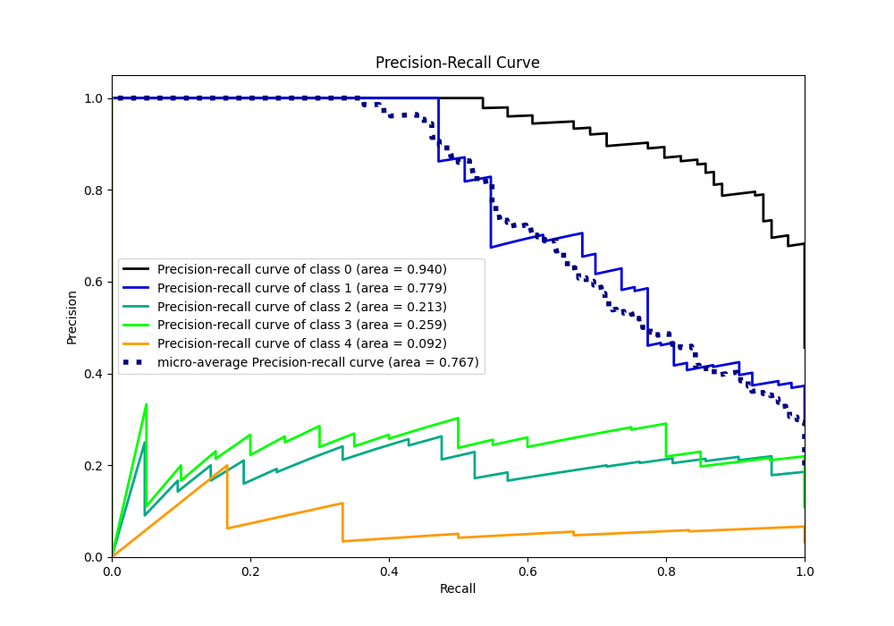

# Summary of 4_Default_Xgboost

[<< Go back](../README.md)

## Extreme Gradient Boosting (Xgboost)
- **n_jobs**: -1
- **objective**: multi:softprob
- **eta**: 0.075
- **max_depth**: 6
- **min_child_weight**: 1
- **subsample**: 1.0
- **colsample_bytree**: 1.0
- **eval_metric**: mlogloss
- **num_class**: 5
- **explain_level**: 1

## Validation
 - **validation_type**: split
 - **train_ratio**: 0.75
 - **shuffle**: True
 - **stratify**: True

## Optimized metric
logloss

## Training time

0.8 seconds

### Metric details
|           |         0 |         1 |          2 |         3 |   4 |   accuracy |   macro avg |   weighted avg |   logloss |
|:----------|----------:|----------:|-----------:|----------:|----:|-----------:|------------:|---------------:|----------:|
| precision |  0.762376 |  0.644068 |  0.125     |  0.214286 |   0 |   0.646739 |    0.349146 |       0.571119 |  0.916748 |
| recall    |  0.916667 |  0.716981 |  0.047619  |  0.15     |   0 |   0.646739 |    0.366253 |       0.646739 |  0.916748 |
| f1-score  |  0.832432 |  0.678571 |  0.0689655 |  0.176471 |   0 |   0.646739 |    0.351288 |       0.602534 |  0.916748 |
| support   | 84        | 53        | 21         | 20        |   6 |   0.646739 |  184        |     184        |  0.916748 |

## Confusion matrix
|              |   Predicted as 0 |   Predicted as 1 |   Predicted as 2 |   Predicted as 3 |   Predicted as 4 |
|:-------------|-----------------:|-----------------:|-----------------:|-----------------:|-----------------:|
| Labeled as 0 |               77 |                4 |                2 |                1 |                0 |
| Labeled as 1 |               11 |               38 |                1 |                3 |                0 |
| Labeled as 2 |                9 |                5 |                1 |                5 |                1 |
| Labeled as 3 |                2 |               11 |                3 |                3 |                1 |
| Labeled as 4 |                2 |                1 |                1 |                2 |                0 |

## Learning curves

## Permutation-based Importance

## Confusion Matrix

## Normalized Confusion Matrix

## ROC Curve

## Precision Recall Curve

[<< Go back](../README.md)
