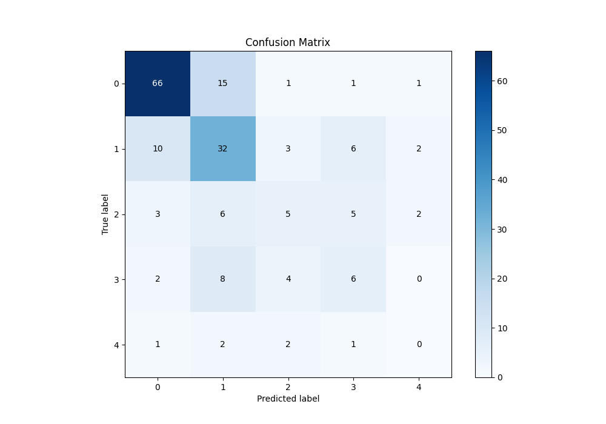

# Summary of 5_Default_NeuralNetwork

[<< Go back](../README.md)

## Neural Network
- **n_jobs**: -1
- **dense_1_size**: 32
- **dense_2_size**: 16
- **learning_rate**: 0.05
- **num_class**: 5
- **explain_level**: 1

## Validation
 - **validation_type**: split
 - **train_ratio**: 0.75
 - **shuffle**: True
 - **stratify**: True

## Optimized metric
logloss

## Training time

0.3 seconds

### Metric details
|           |         0 |         1 |         2 |         3 |   4 |   accuracy |   macro avg |   weighted avg |   logloss |
|:----------|----------:|----------:|----------:|----------:|----:|-----------:|------------:|---------------:|----------:|
| precision |  0.804878 |  0.507937 |  0.333333 |  0.315789 |   0 |   0.592391 |    0.392387 |       0.586121 |   1.94448 |
| recall    |  0.785714 |  0.603774 |  0.238095 |  0.3      |   0 |   0.592391 |    0.385517 |       0.592391 |   1.94448 |
| f1-score  |  0.795181 |  0.551724 |  0.277778 |  0.307692 |   0 |   0.592391 |    0.386475 |       0.587086 |   1.94448 |
| support   | 84        | 53        | 21        | 20        |   6 |   0.592391 |  184        |     184        |   1.94448 |

## Confusion matrix
|              |   Predicted as 0 |   Predicted as 1 |   Predicted as 2 |   Predicted as 3 |   Predicted as 4 |
|:-------------|-----------------:|-----------------:|-----------------:|-----------------:|-----------------:|
| Labeled as 0 |               66 |               15 |                1 |                1 |                1 |
| Labeled as 1 |               10 |               32 |                3 |                6 |                2 |
| Labeled as 2 |                3 |                6 |                5 |                5 |                2 |
| Labeled as 3 |                2 |                8 |                4 |                6 |                0 |
| Labeled as 4 |                1 |                2 |                2 |                1 |                0 |

## Learning curves

## Permutation-based Importance

## Confusion Matrix

## Normalized Confusion Matrix

## ROC Curve

## Precision Recall Curve

[<< Go back](../README.md)
