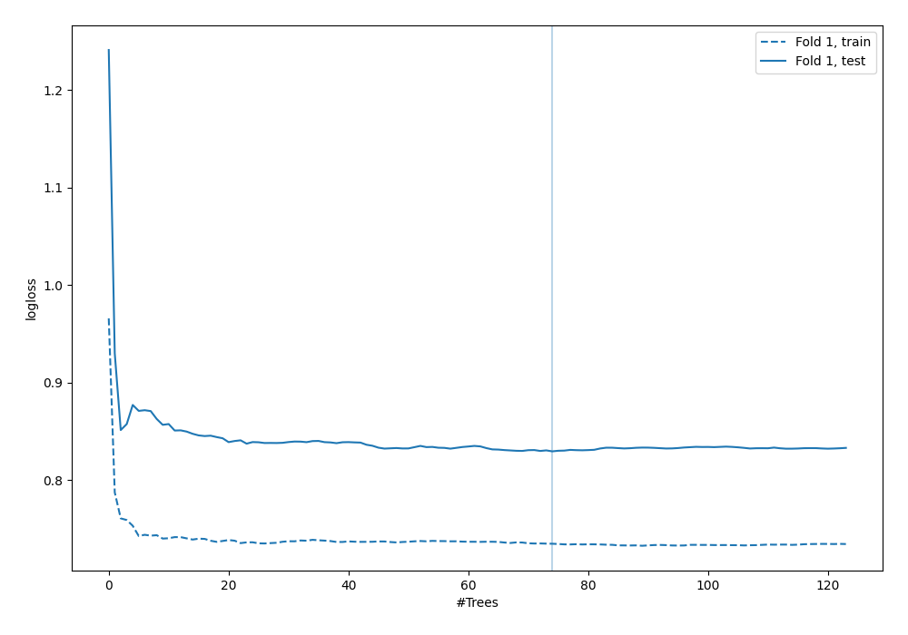
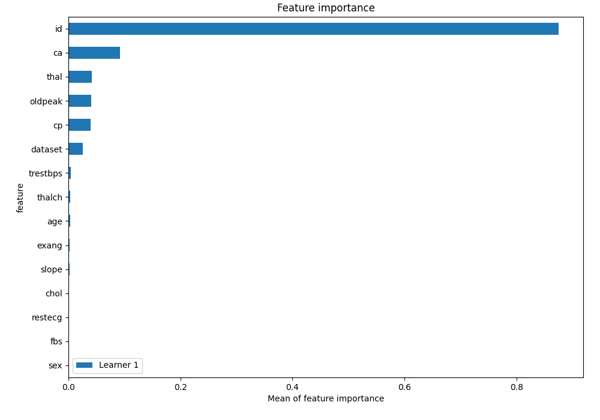
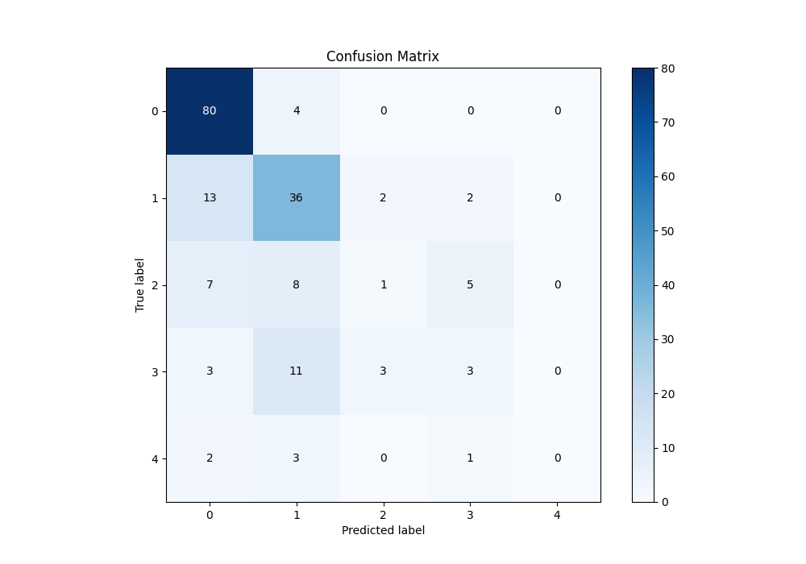
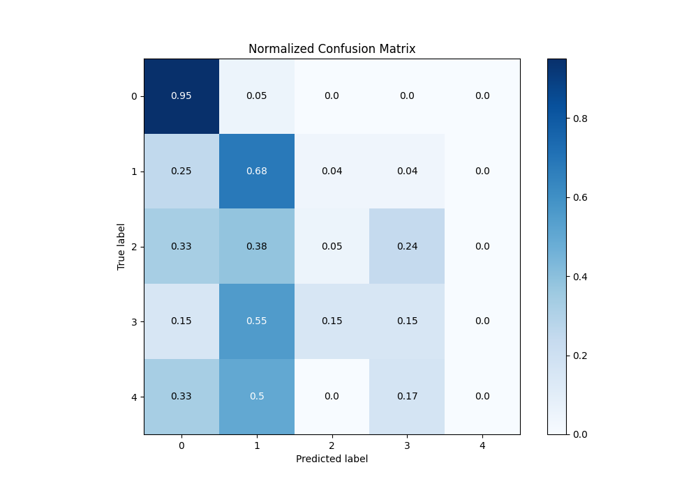
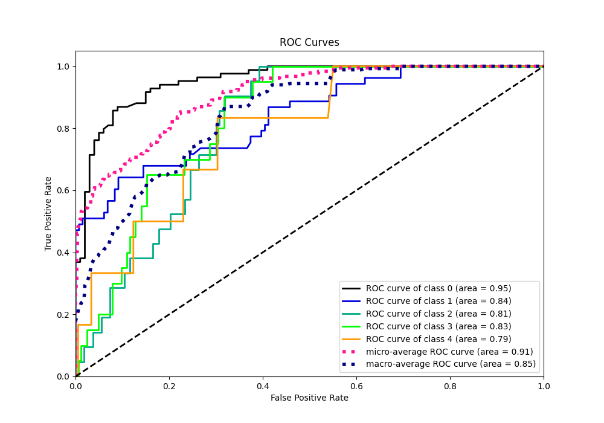
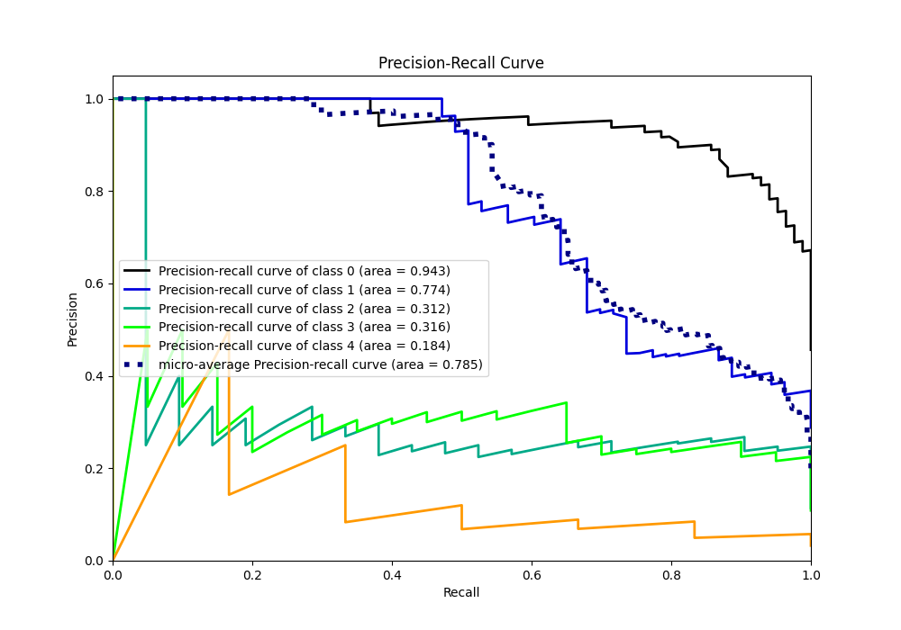

# Summary of 6_Default_RandomForest

[<< Go back](../README.md)

## Random Forest
- **n_jobs**: -1
- **criterion**: gini
- **max_features**: 0.9
- **min_samples_split**: 30
- **max_depth**: 4
- **eval_metric_name**: logloss
- **num_class**: 5
- **explain_level**: 1

## Validation
 - **validation_type**: split
 - **train_ratio**: 0.75
 - **shuffle**: True
 - **stratify**: True

## Optimized metric
logloss

## Training time

0.7 seconds

### Metric details
|           |         0 |         1 |          2 |         3 |   4 |   accuracy |   macro avg |   weighted avg |   logloss |
|:----------|----------:|----------:|-----------:|----------:|----:|-----------:|------------:|---------------:|----------:|
| precision |  0.761905 |  0.580645 |  0.166667  |  0.272727 |   0 |   0.652174 |    0.356389 |       0.563743 |  0.829517 |
| recall    |  0.952381 |  0.679245 |  0.047619  |  0.15     |   0 |   0.652174 |    0.365849 |       0.652174 |  0.829517 |
| f1-score  |  0.846561 |  0.626087 |  0.0740741 |  0.193548 |   0 |   0.652174 |    0.348054 |       0.596306 |  0.829517 |
| support   | 84        | 53        | 21         | 20        |   6 |   0.652174 |  184        |     184        |  0.829517 |

## Confusion matrix
|              |   Predicted as 0 |   Predicted as 1 |   Predicted as 2 |   Predicted as 3 |   Predicted as 4 |
|:-------------|-----------------:|-----------------:|-----------------:|-----------------:|-----------------:|
| Labeled as 0 |               80 |                4 |                0 |                0 |                0 |
| Labeled as 1 |               13 |               36 |                2 |                2 |                0 |
| Labeled as 2 |                7 |                8 |                1 |                5 |                0 |
| Labeled as 3 |                3 |               11 |                3 |                3 |                0 |
| Labeled as 4 |                2 |                3 |                0 |                1 |                0 |

## Learning curves

## Permutation-based Importance

## Confusion Matrix

## Normalized Confusion Matrix

## ROC Curve

## Precision Recall Curve

[<< Go back](../README.md)
